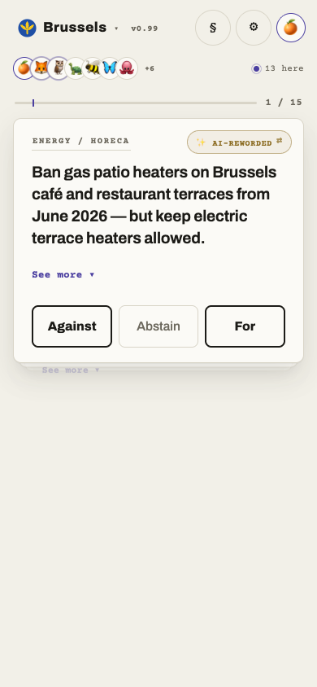
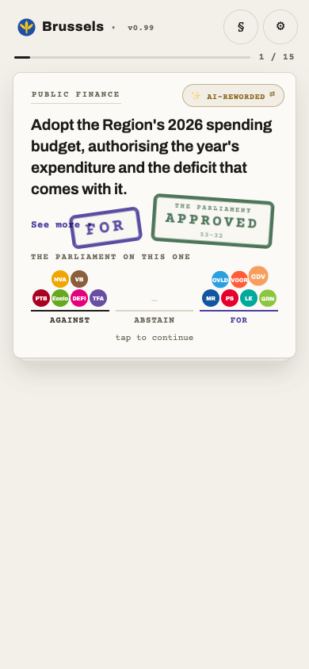
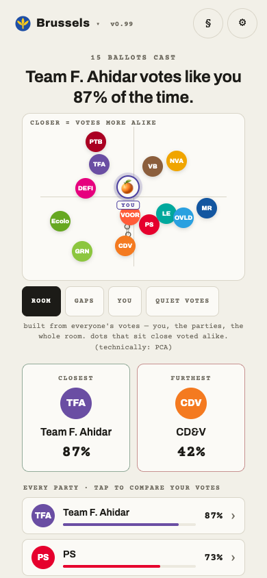
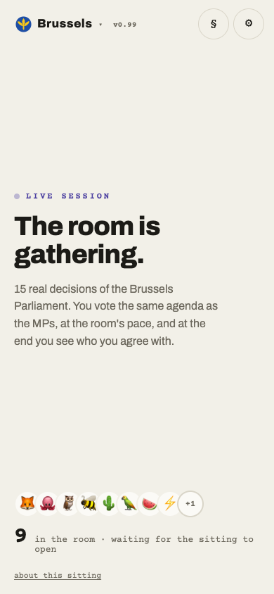
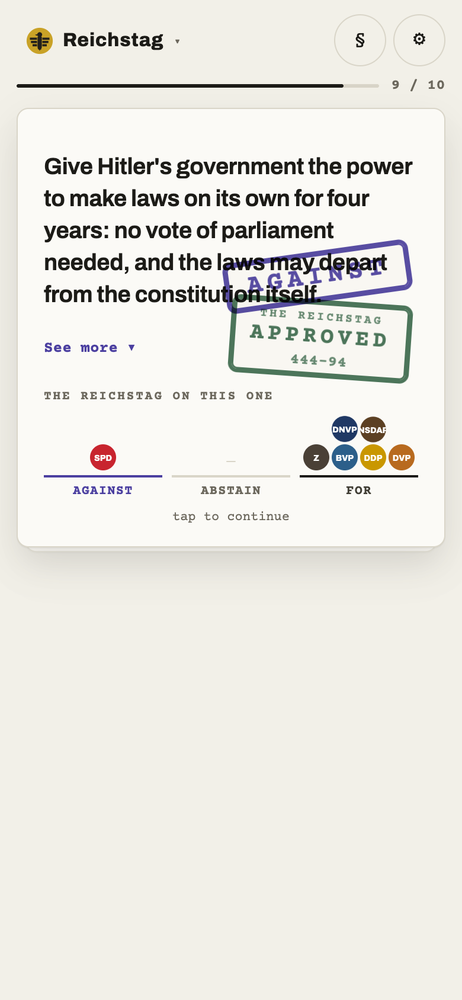

# RIOT

**An engine that turns what a parliament actually decided into something a normal person can vote on.**

A council or parliament publishes its decisions as dense legal minutes that almost nobody reads. RIOT
ingests that record, works out how every party actually voted from the official roll call, and rewrites
each decision as a plain card you can swipe through and vote on yourself. Every card links straight back
to the source document, so nothing has to be taken on trust.

> 🔗 **Try it:** https://andratwiro.github.io/riot/?city=brussels (or `?city=congress`)

The two easiest places to start are **Brussels** (the Brussels-Capital regional Parliament) and the
**US Congress**. Pick one, vote the same agenda the politicians voted, and at the end see which party
you actually line up with.

## The path, on a phone

| | | |
|:--:|:--:|:--:|
|  |  |  |
| **The card.** The decision, reworded into one plain line. Against / Abstain / For. | **The verdict.** What the chamber actually stamped, and where each party stood. | **The map.** Everyone's votes laid out. Who you sit closest to, who you sit furthest from. |

## What the engine does

For each decision, in one committed table:

```
fetch the official record  ─►  extract every member's vote  ─►  aggregate to each party
   (scripts/fetch_*.py)            (the per-member roll call)       (its real recorded vote)
                                                                            │
   one row per decision  ◄──────────  rewrite into a layered card  ◄────────┘
   id · title · date · body                plain headline
   source_url · context                    the brief (why it matters)
   votes { party…, rob, ai } · counts      analyst read (how the room split)
                                           always linked back to the source
```

Two things are worth being precise about:

- **The party votes are never guessed.** They come from the official per-member roll call, counted up
  per party. The verdict and the margins are the real ones.
- **The rewriting is the hard part, and it is kept honest.** Each decision becomes a short headline plus
  a couple of layers (the brief, an analyst read), and the thread back to the source is never cut. On the
  live councils the rewording is drafted with AI and checked; the historical decks are hand written and
  fact-checked against the record. A kid should be able to understand any of these topics.

## Two ways to use it

**Together (a room).** One person opens a live sitting on a screen, everyone else joins with a phone.
The room votes the agenda card by card, at the room's pace. Under each card the crowd fans into Against /
Abstain / For, sitting right below the chamber's own verdict. So you read the room against the council:
the room agrees, or the room would have decided differently. What happened in the chamber, against what
the people in the room actually wanted.



**Alone.** Swipe through the deck at your own pace, vote each card, and get your affinity with every party
plus an opinion map at the end. This is also how you re-run history: sit down and cast the votes that a
parliament once cast, decision by decision.



> *The Enabling Act of March 1933, in the Weimar deck: the same engine, on the vote that ended a republic.
> The Reichstag stamped it 444 to 94, the SPD alone against.*

## The instances

One engine, one shared viewer, swap the city with `?city=`.

**Live councils, built from the public record:**

- **Reus** (`?city=reus`) my own city council, and the deepest example. This is where the personal
  experiment lives (see below). It is mine to obsess over, not the one to show a stranger first.
- **Brussels** (`?city=brussels`) the Brussels-Capital regional Parliament, 15 real decisions computed
  from the per-member roll call.
- **Bundestag** (`?city=bundestag`) the German federal parliament, ten recorded votes, all in German,
  parsed from the Bundestag's official ballots.

**Landmark decks, history re-run as ballots:**

- **Congress** (`?city=congress`) sixteen landmark US roll calls, the four floor caucuses as the parties.
- **Commons 2019** (`?city=commons`) the Brexit endgame in the House of Commons: the three Meaningful
  Votes, the no-deal rejection, the Article 50 extension and the eight indicative-vote options.
- **South Africa** (`?city=southafrica`) ten landmark votes of the democratic-era Parliament, 1996 to 2025.
- **Tunisia** (`?city=tunisia`) ten landmark votes of the post-revolution parliament, 2014 to 2018. A
  memorial deck for the chamber that was locked in 2021.
- **Weimar 29 to 33** (`?city=weimar`) the Reichstag's final years, ten votes ending at the Enabling Act,
  hand written from the stenographic record.

## The personal experiment (GHOST)

The original question that started RIOT was a narrower, more personal one: can an AI trained on me vote
the way I would, on real decisions it has never seen? That experiment runs on **Reus only**. I vote the
contested decisions by hand. A profile of my politics (`soul.md`, never committed) votes the same
decisions blind, with no sight of my answers. Then the engine reports how often the AI called my actual
votes right. The point is not "the AI is my closest party," which proves nothing. The point is the
out-of-sample hit rate on votes it was never shown.

Every other city ships with this turned off. It is a side experiment on top of the engine, not the engine.

## How it's built

Vanilla HTML, CSS and JavaScript. No framework, no build step, no backend. The whole thing is a static
site on GitHub Pages, because the council data is already public and a static site has nothing to leak.

```
index.html   reads ?city=<id>   and loads, in this order:

  cities/<id>/config.js   copy and chrome for this city
  cities/<id>/data.js     the parties and the decisions
  app.js  →  map.js  →  views.js  →  multiplayer.js  →  live.js  →  roomfloor.js
  (one shared viewer serves every city)
```

| File | What it does |
|---|---|
| `app.js` | The core: the deck, the card stack, the vote, the per-card reveal. |
| `map.js` | The opinion map: every party and voter projected onto two axes. |
| `views.js` | The minutes (raw source log), party comparison, votes export and import. |
| `multiplayer.js` | Async rooms: who is here, anonymous running tallies. |
| `live.js` | Live sittings: the room moving through the agenda together, in lockstep. |
| `roomfloor.js` | The footer crowd in a live sitting (the people fanning into columns). |
| `scripts/*.py` | The data pipeline: fetch the record, extract per-member votes, build each city's `data.js`. |
| `firebase-config.js` | Optional shared-room backend. Set it to `null` and the site runs single-player. |

Adding a city is two files: `cities/<id>/config.js` and `cities/<id>/data.js`. See
[`docs/ARCHITECTURE.md`](docs/ARCHITECTURE.md) for the map and [`AGENTS.md`](AGENTS.md) for the per-file
and per-pipeline detail.

## Run it locally

It is a static site, so any local file server works:

```
python3 -m http.server 8000
# then open http://localhost:8000/?city=brussels
```

Shared rooms need a Firebase Realtime Database (see `firebase-config.js`). Leave that config `null` and
everything still works single-player.

## Data provenance

All vote data comes from public records: Reus city council's plenary minutes on the
[AudioVideoActa portal](https://serveis.reus.cat/actes), the Brussels-Capital Parliament's plenary records
on [weblex.brussels](http://weblex.brussels), the Bundestag's official ballots, the UK's CommonsVotes
record, and the published roll calls and stenographic records behind the landmark decks. Every decision
links back to its own source.

## Privacy

`soul.md` (the profile the GHOST votes from) and my own manual votes are never committed. The repo is
public; those two private inputs are not. Your own votes live in your browser and are never sent anywhere.

## License

Copyright © 2026 Roberto Andrade.

RIOT is free software under the **GNU Affero General Public License v3.0** (AGPL-3.0). You may use, study,
share and modify it under those terms. Because of the AGPL's network clause, if you run a modified version
as a public web service you have to offer your users its source. See [`LICENSE`](LICENSE) for the full
text, or <https://www.gnu.org/licenses/agpl-3.0.html>. The vote data stays the public record of the
parliaments it comes from.
